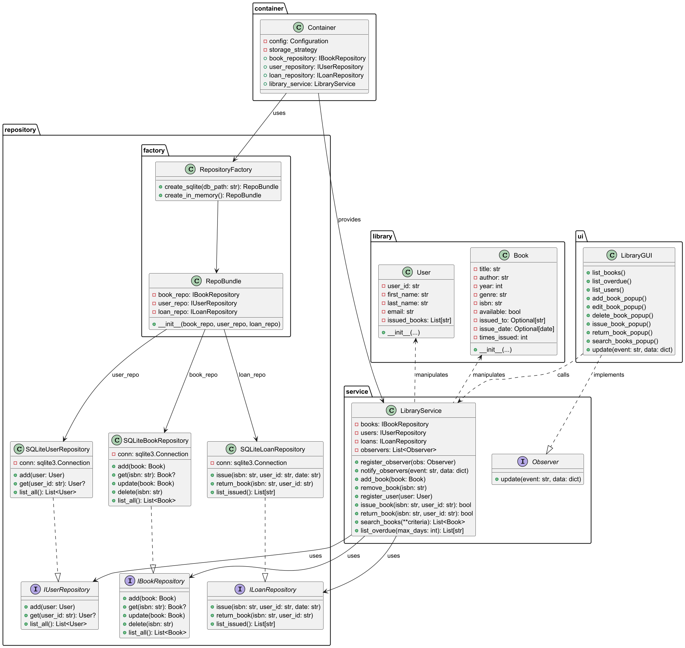
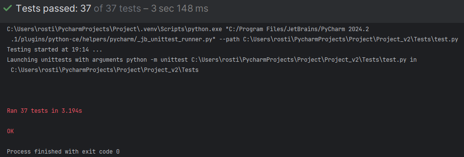
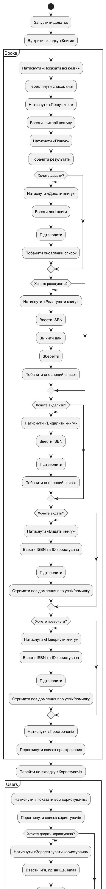

# Library Manager

## Огляд проекту

**Library Manager** — це настільний додаток на Python з GUI (`tkinter/ttk`) для керування бібліотечними ресурсами.

### Основний функціонал

* Додавання, редагування, видалення книг, вивід списку книг
* Реєстрація користувачів, вивід списку користувачів
* Видача та повернення книг
* Пошук за різними критеріями
* Перегляд прострочених книг

## Використані шаблони проектування

### 1. **Factory Method**

**Де використано:**

* У `Project_v2.container.Container` реалізовано провайдери репозиторіїв через `providers.Factory`.

**Призначення:**

* Відділення логіки створення конкретної реалізації (`SQLiteBookRepository`, `SQLiteUserRepository`, `SQLiteLoanRepository`) від їх використання у сервісі.

**Як це працює:**

```python
book_repo = providers.Factory(SQLiteBookRepository, conn=database_connection)
```

### 2. **Strategy**

**Де використано:**

* Можливість підміни сховища даних: зараз це SQLite, але через інтерфейси `IBookRepository`, `IUserRepository`, `ILoanRepository` можна підключити іншу реалізацію (напр., PostgreSQL чи in-memory).

**Призначення:**

* Динамічна заміна алгоритму доступу до даних без змін у клієнтському коді.

### 3. **Observer (спостерігач)**

**Де використано (планується):**

* UI може підписуватись на події в сервісі, щоб автоматично оновлювати списки книг після видачі чи повернення.

**Призначення:**

* Забезпечити реактивне оновлення GUI при змінах у бізнес-логіці.

### 4. **Dependency Injection**

**Де використано:**

* Контейнер `dependency_injector` для конфігурації та передачі залежностей у класи без прямого імпорту.

**Призначення:**

* Спрощує заміну реалізацій, покращує тестованість.

## Дизайн-принципи SOLID

* **S (Single Responsibility):** кожен клас відповідає за одну задачу (Book/User — модель, репозиторій — доступ до даних, сервіс — логіка, GUI — представлення).
* **O (Open/Closed):** система розширюється через нові реалізації інтерфейсів без зміни існуючого коду.
* **L (Liskov Substitution):** всі репозиторії можна підміняти один на інший.
* **I (Interface Segregation):** протоколи розділені на потрібну кількість методів (CRUD vs Loan).
* **D (Dependency Inversion):** залежність від абстракцій (`Protocol`), а не від конкретних класів.

## Структура проекту

```
Project_v2/
├── library/                  # Домени: Book, User
├── repository/               # Інтерфейси та реалізації репозиторіїв
├── service/                  # Бізнес-логіка (LibraryService)
├── database.py               # Ініціалізація БД
├── container.py              # Налаштування DI-контейнера
├── Client.py                 # GUI-додаток
└── Tests/                    # Unit-тести
```

## Тестування

* Включено 27 модульних тестів для репозиторіїв, сервісів і GUI-методів і тд.

## Масштабованість

* Додавання нових типів сховищ (Redis, PostgreSQL) вимагає лише написати новий клас-реалізацію інтерфейсу та змінити провайдер у `container.py`.
* Шаблон Observer дозволить в майбутньому просто підписати GUI на події сервісу.

## UMl-діаграма активності
